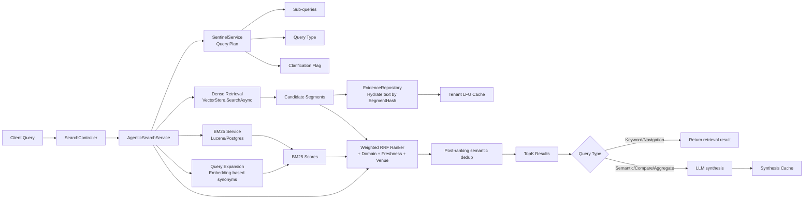
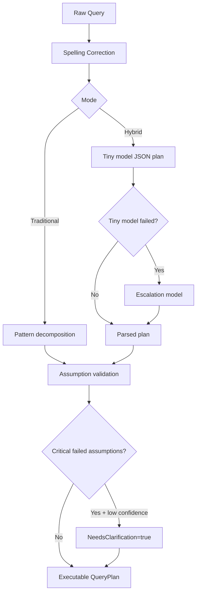
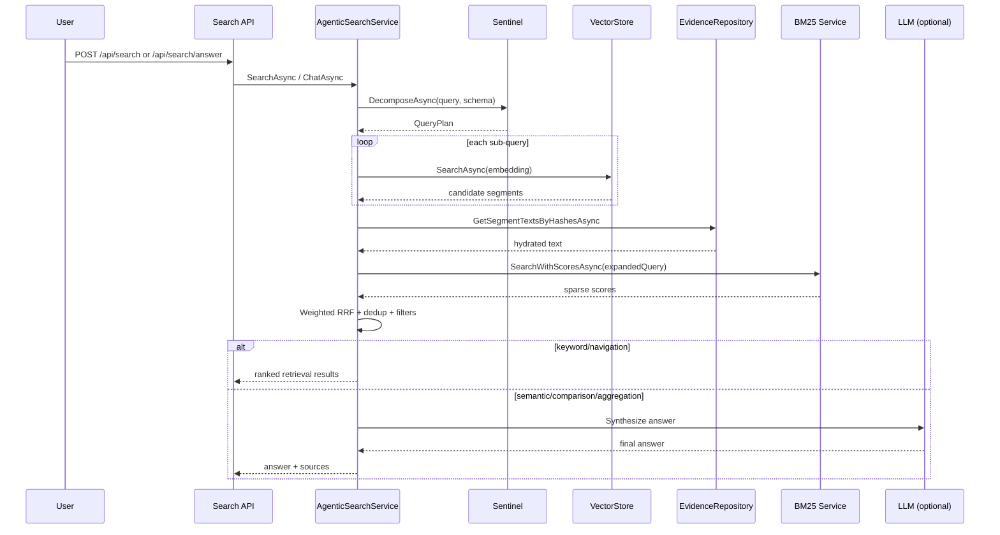

# *lucid*RAG Retrieval System Deep Dive

This document explains how *lucid*RAG retrieval works end-to-end in the current codebase, focusing on retrieval, ranking, and evidence handling.

## Scope

This covers the runtime path for:

- `POST /api/search` (retrieval-only)
- `POST /api/search/answer` (retrieval + synthesis, stateless)
- `POST /api/chat` and chat streaming where retrieval is reused

Core implementation files:

- `src/LucidRAG.Core/Services/AgenticSearchService.cs`
- `src/LucidRAG.Core/Services/Sentinel/SentinelService.cs`
- `src/LucidRAG.Core/Services/EvidenceRepository.cs`
- `src/LucidRAG.Core/Services/QueryExpansionService.cs`
- `src/LucidRAG.Core/Services/LuceneBm25SearchService.cs`
- `src/LucidRAG.Plugin.Postgres/PostgresBm25Service.cs`
- `src/LucidRAG/Controllers/Api/SearchController.cs`

## Why This Retrieval Stack Is Different

*lucid*RAG is not a plain “embed + top-k” system. It combines:

- Query planning with **Sentinel** (decomposition, assumptions, clarification gating)
- Multi-strategy candidate generation (dense retrieval + optional BM25)
- **Text hydration** from evidence artifacts using `SegmentHash`
- Multi-signal fusion ranking (dense + BM25 + salience + freshness + domain + venue quality)
- Post-ranking semantic deduplication
- Query-type aware behavior (keyword/navigation can skip synthesis)
- Caching at multiple layers (tenant evidence cache + synthesis cache)

## High-Level Architecture



## Request Lifecycle

### 1. API entry and mode selection

`SearchController` maps incoming `searchMode` to:

- `semantic`
- `keyword`
- default `hybrid`

```csharp
var searchMode = request.SearchMode?.ToLowerInvariant() switch
{
    "semantic" => SearchMode.Semantic,
    "keyword" => SearchMode.Keyword,
    _ => SearchMode.Hybrid
};
```

### 2. Document scope resolution

`AgenticSearchService.SearchAsync` resolves document scope:

- Uses explicit `DocumentIds` if provided
- Else searches all completed docs in the selected collection

### 3. Query planning with Sentinel

Sentinel builds schema context from current corpus state, then decomposes query into a `QueryPlan`:

- spelling/grammar correction first
- decomposition mode: traditional pattern mode or hybrid tiny-model mode
- optional assumption validation against data/schema
- clarification gating when confidence is low and assumptions fail

```csharp
var options = new SentinelOptions
{
    CollectionId = request.CollectionId,
    DocumentIds = documentIds,
    ValidateAssumptions = true,
    Mode = _prompts.QueryDecomposition.Enabled ? ExecutionMode.Hybrid : ExecutionMode.Traditional
};

var queryPlan = await sentinelService.DecomposeAsync(request.Query, schema, options, ct);
```

### 4. Sub-query candidate generation (dense)

For each sub-query (ordered by priority), *lucid*RAG:

- embeds the sub-query
- searches vector store
- accumulates candidates with dense score

Then segment IDs are deduplicated, keeping best dense score.

### 5. Segment text hydration via evidence repository

Vector store candidates may not carry full text payload. *lucid*RAG hydrates text by `Segment.ContentHash` via `EvidenceRepository.GetSegmentTextsByHashesAsync`.

Hydration strategy:

- per-tenant LFU cache lookup first (if tenant context/cache enabled)
- DB fetch of `segment_text` artifacts for misses
- inline text preferred (fast path)
- blob fallback for non-inline artifacts
- cache fill for misses

This is a key design choice: retrieval vectors and textual evidence remain separable but linked by hash.

### 6. Hybrid/keyword ranking via weighted RRF

If mode is `Semantic`, ranking is dense-score only.

If mode is `Hybrid` or `Keyword`, *lucid*RAG applies weighted reciprocal-rank fusion in `ApplyBm25RrfAsync`.

Signals ranked independently:

- dense similarity
- BM25 score
- salience score
- freshness (`Document.CreatedAt`)
- domain relevance
- venue quality (`metadata.venue_quality`)

RRF constant: `k = 60`

```csharp
// RRF contribution pattern
rrfScores[id] = weight * (1.0 / (rrfK + rank));
```

Mode-aware weights:

- `Keyword`: BM25-heavy
- `Hybrid`: balanced dense/BM25 with strong domain contribution

### 7. Domain relevance signal

Domain relevance is computed from segment metadata + domain plugins:

- entity overlap between query and `DomainEntities`
- plugin-defined query relevance terms
- base boost from `DomainConfidence`

This keeps domain behavior extensible through `IDomainPluginRegistry`, not hardcoded in retrieval logic.

### 8. Post-ranking dedup + filters

After scoring, *lucid*RAG performs semantic cross-document deduplication and then applies optional:

- `DomainFilter`
- `EntityFilter`

Only then final `TopK` is returned.

### 9. Query-type aware synthesis boundary

`SentinelService` classifies query type:

- `Keyword` / `Navigation`: return matched documents (no synthesis)
- `Semantic` / `Comparison` / `Aggregation`: synthesize answer

This avoids unnecessary LLM passes for navigational queries.

## Sentinel Planning Details

Sentinel combines deterministic and model-assisted planning.



Notable runtime behaviors:

- Follow-up detection supports pronoun/coreference resolution and semantic similarity checks
- High-confidence follow-ups can reuse the prior conversation’s active document set
- Clarification prompts are generated when plan confidence drops below threshold

## Query Expansion for BM25

*lucid*RAG uses embedding-based query expansion before BM25 scoring:

- tokenizes query
- skips stopwords/short terms
- expands terms via similarity search over a pre-embedded vocabulary
- builds expanded query text

```csharp
var expandedQuery = await queryExpansion.ExpandQueryAsync(query, 3, ct);
var queryForBm25 = expandedQuery.ExpandedQueryText;
```

Purpose: improve sparse retrieval recall without dense-only dependence.

## BM25 Provider Abstraction

`IBm25SearchService` is provider-agnostic.

Implementations:

- `LuceneBm25SearchService` (core/default)
- `PostgresBm25Service` plugin (PostgreSQL FTS using `ts_rank_cd`)

`AgenticSearchService` consumes the interface only, so ranking logic is stable while BM25 backend can change.

## Evidence Hydration and Storage Model

Evidence artifacts are stored with metadata and optional inline text content.

Key retrieval-relevant fields:

- `ArtifactType` (e.g., `segment_text`)
- `SegmentHash`
- `Content` (inline text) or blob `StoragePath`

Hydration method:

```csharp
var textLookup = await evidenceRepository.GetSegmentTextsByHashesAsync(segmentHashes, ct);
if (textLookup.TryGetValue(segment.ContentHash, out var text))
    segment.Text = text;
```

This enables fast text lookup while keeping vector index payload minimal.

## Caching Layers

### Tenant evidence cache

`TenantLfuCacheService` provides per-tenant LFU caches for:

- evidence text (`segmentHash -> text`)
- entities (`entityId -> entity`)

Benefits:

- tenant isolation
- reduced DB/blob roundtrips
- bounded memory per tenant

### Synthesis cache

`SynthesisCacheService` caches answer text keyed by query + evidence hash and tracks model used.

Behavior highlights:

- absolute and sliding expiration
- optional invalidation on model change
- optional evidence-only cache for re-synthesis

## Manifested Retrieval Pipeline (Conceptual Contract)

*lucid*RAG also defines retrieval contracts as manifests:

- `src/LucidRAG/manifests/pipelines/rag-search.pipeline.yaml`
- `src/LucidRAG/manifests/waves/dense-retrieval.wave.yaml`
- `src/LucidRAG/manifests/waves/bm25-retrieval.wave.yaml`
- `src/LucidRAG/manifests/waves/rrf-ranker.wave.yaml`

Stage model:

1. stage-0 retrieval: dense + BM25 in parallel
2. stage-1 scoring: salience
3. stage-2 ranking: RRF fusion
4. stage-3 synthesis: answer generation

This is a declarative model of the same retrieval intent the service code executes.

## Endpoints and Usage

### Retrieval only

```http
POST /api/search
Content-Type: application/json

{
  "query": "Compare Redis and PostgreSQL for caching",
  "searchMode": "hybrid",
  "topK": 10
}
```

Returns ranked segments with scores and metadata, no synthesized answer.

### Stateless answer

```http
POST /api/search/answer
Content-Type: application/json

{
  "query": "What does this corpus say about tenant-isolated caching?",
  "searchMode": "hybrid"
}
```

Runs retrieval and synthesis without creating conversation memory.

## Implementation Notes and Tradeoffs

- Retrieval quality comes from signal fusion, not any single retriever.
- Query planning cost is repaid on complex prompts by better recall/precision.
- Hash-based hydration decouples vector payload from textual evidence storage.
- Domain plugins increase relevance without hardwiring domain heuristics into the core ranker.
- Query-type gating saves LLM budget on navigational requests.

## Extension Points

- Add BM25 backend by implementing `IBm25SearchService`.
- Add new domain behavior via `IDomainPlugin` + registry.
- Tune fusion behavior by adjusting per-mode weights in `ApplyBm25RrfAsync`.
- Add new signals (e.g., authority, citation density) as additional RRF rank lists.
- Adjust Sentinel model strategy and clarification thresholds in config.

## Minimal Sequence Diagram



## Related Docs

- `docs/CONVERSATIONAL_RAG.md`
- `docs/DEDUPLICATION_STRATEGY.md`
- `docs/UNIFIED_LLM_PROVIDERS.md`
- `src/LucidRAG/README.md`
